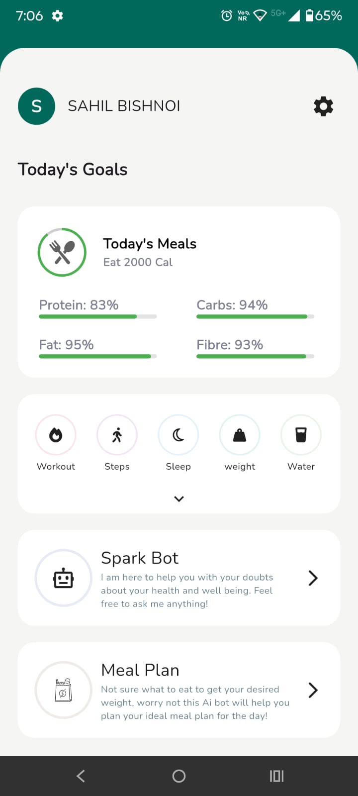
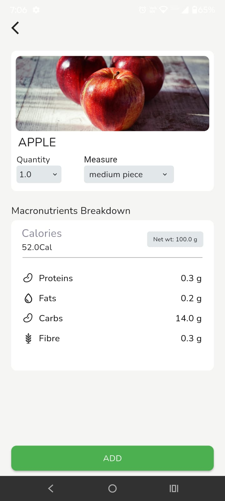
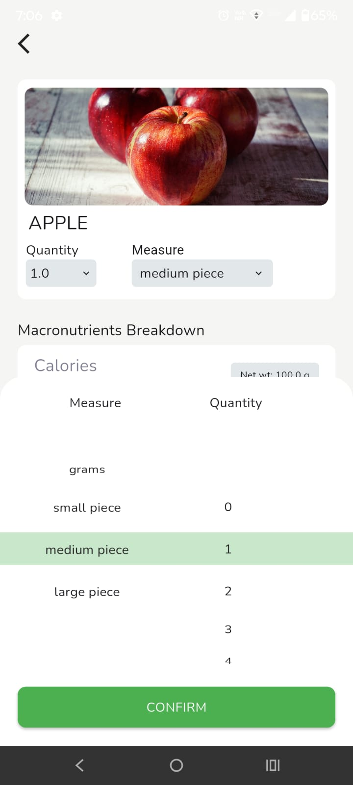
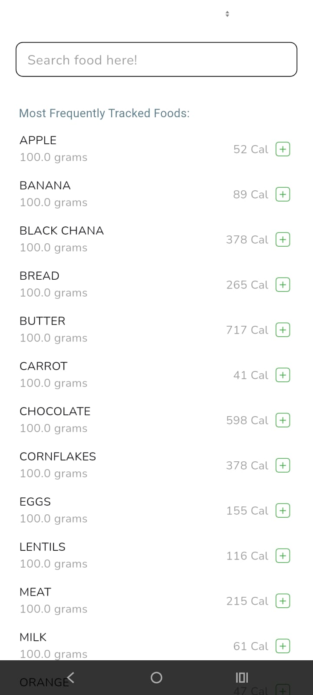
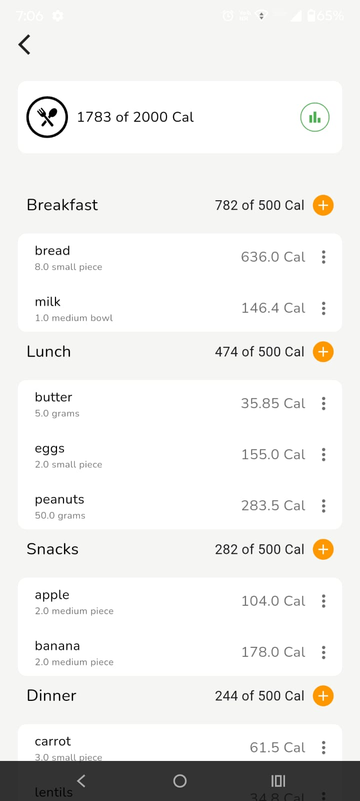
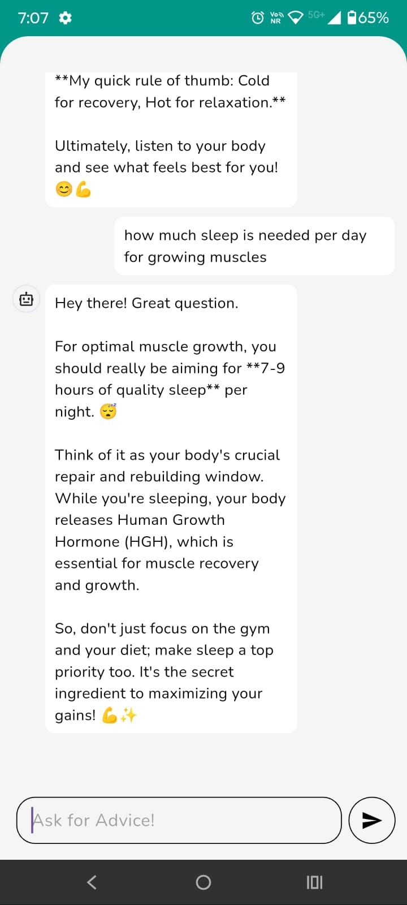
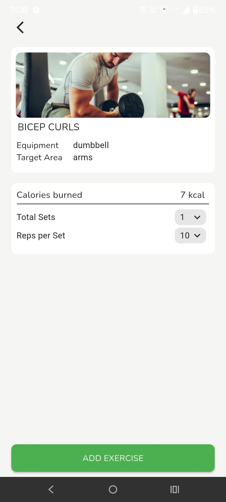

# FitSpark

A fitness-focused Flutter application designed to help you stay healthy and active by managing your daily fitness needs.

## Features

- 🥗 **Meal Planner** – Plan and track your meals with ease.  
- 🏋️ **Exercise Tracking** – Log your workouts and monitor progress.  
- 🚶 **Step Counter** – Keep track of your daily steps.  
- 😴 **Sleep Tracker** – Record and analyze your sleep patterns.  
- 💧 **Water Reminder** – Stay hydrated with timely water intake reminders.  

## Screenshots

| Home | Meal Planner | Exercise | Sleep | Water |
|------|--------------|----------|-------|-------|
|  |  |  |  |  |  |                                                | [Steps Counter] (images/WhatsApp Image 2025-07-24 at 19.11.49_d3258b6c.jpg) |

## Getting Started

This project is a starting point for a Flutter application.

A few resources to help you get started:

- [Lab: Write your first Flutter app](https://docs.flutter.dev/get-started/codelab)  
- [Cookbook: Useful Flutter samples](https://docs.flutter.dev/cookbook)  

For help getting started with Flutter development, view the  
[online documentation](https://docs.flutter.dev/), which offers tutorials, samples, guidance on mobile development, and a full API reference.  

---

✨ *FitSpark – Spark your fitness journey!*
